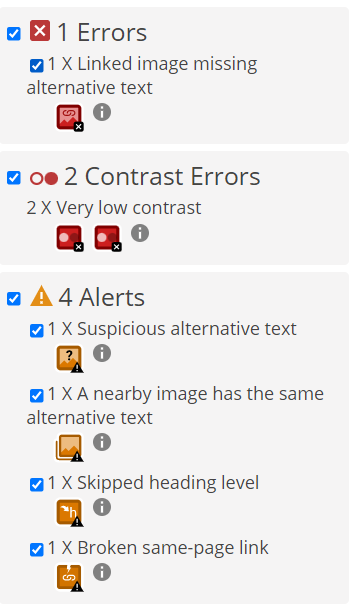
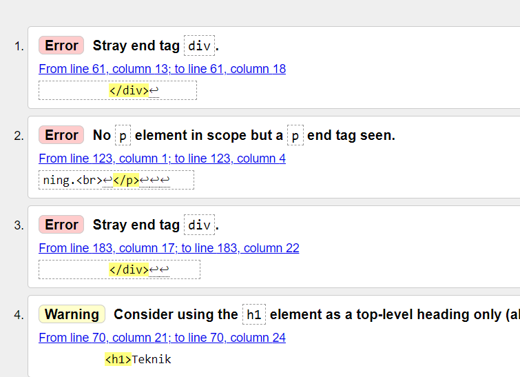

## Nizar Dawood 
2022-06-01

## Inledning
under de senaste veckorna har vi arbetat med att göra om en kampanij hemsida .
uppgiften är att redesigna en webbplats. Ett samarbete med svenskan där vi har skrivit en kampanij och ska lägga in det i en hemsida.

## Bakgrund
1. jag började med att skissa på papper hur hemsidan skulle se utt och sedan ritade jag ut den på figgma och gjorde några sjuteringar.

2. letade efter bilder på unsplash och färger som passar min målgrup

3. I visulstudio började jag med att  lägga in min text och ta bort det kod jag inte behövde 
.ändrade  nav bar, lägde till containrar och classer till bilder och text
4.

 

4.

jag har wavat och validerat hemsidan  hemsidan det var inga problem naär jag validerade hemsidan bara att det fanns två slut märken </> efter varandra  
'''

'''

## Negativa erfarenheter

 anpassa efter  skärm storleken.

## Positiva erfarenheter

## Sammanfattning

över lag gick det bra och jag har lärt mig hur man använder mediaquaries
mer säker på html grunderna. till nästa gång behöver jag göra en tydligare planering och börja med mobile first och börja med att lägga in text.
För att förbättra den här hemsidan så behöver jag fixa nav baren till en meny så att det går att använda på mobil.lägg inbilder 

